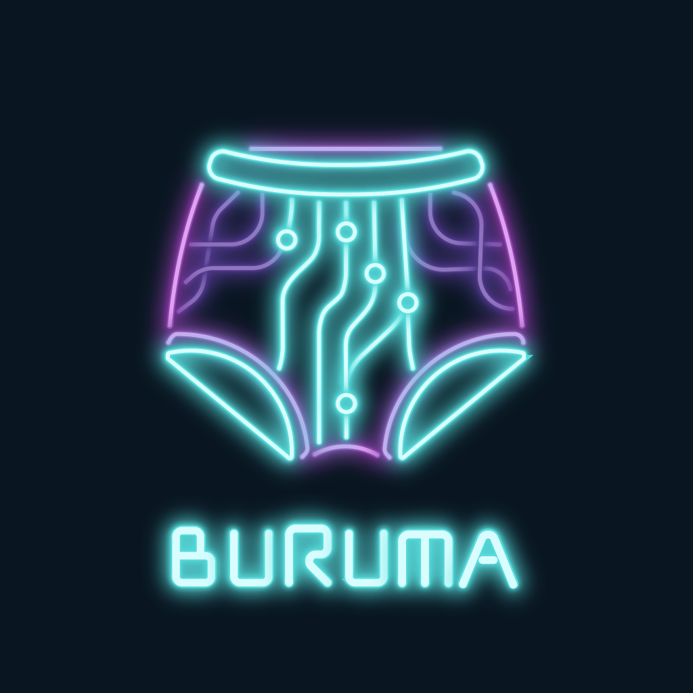
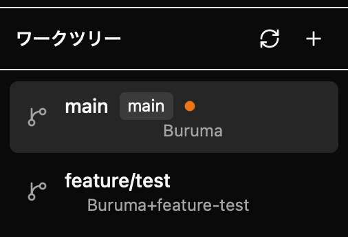
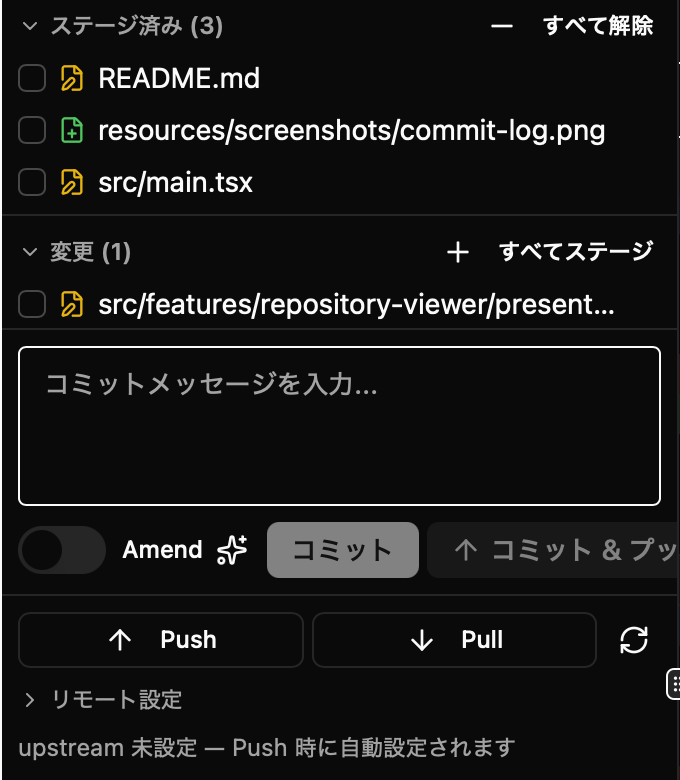
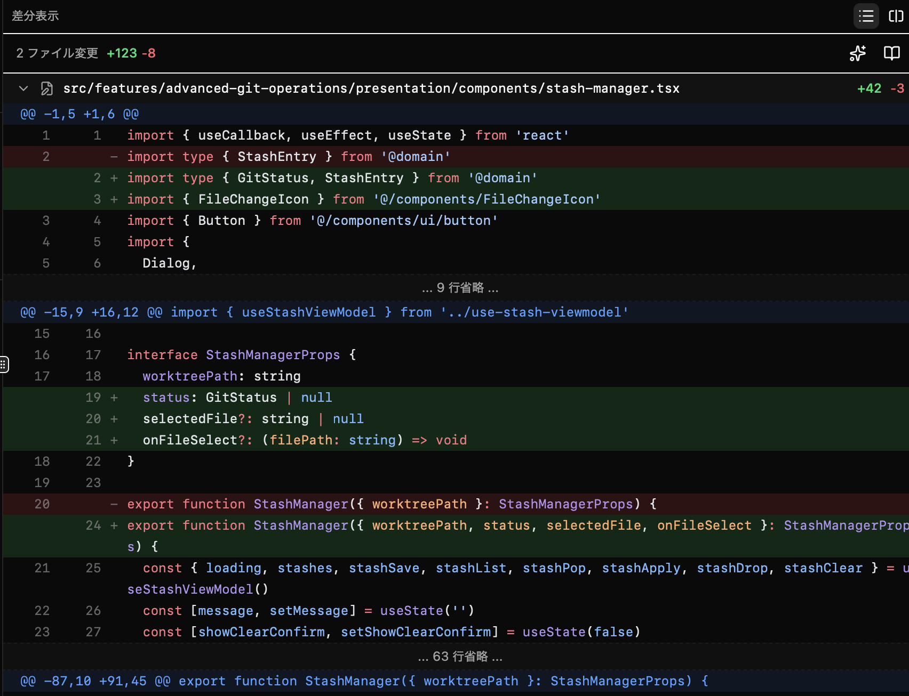
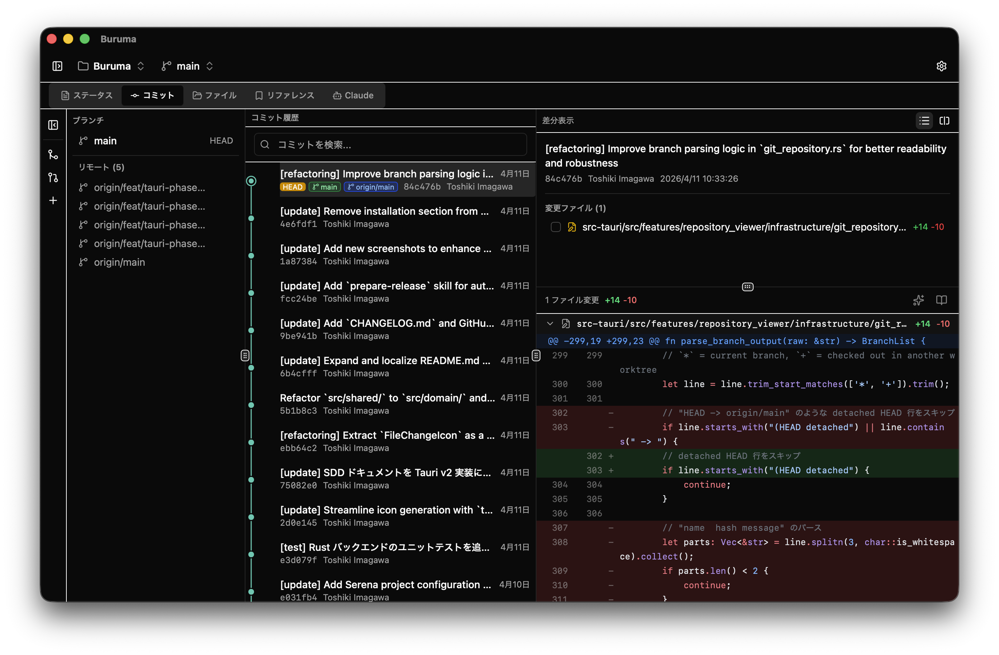
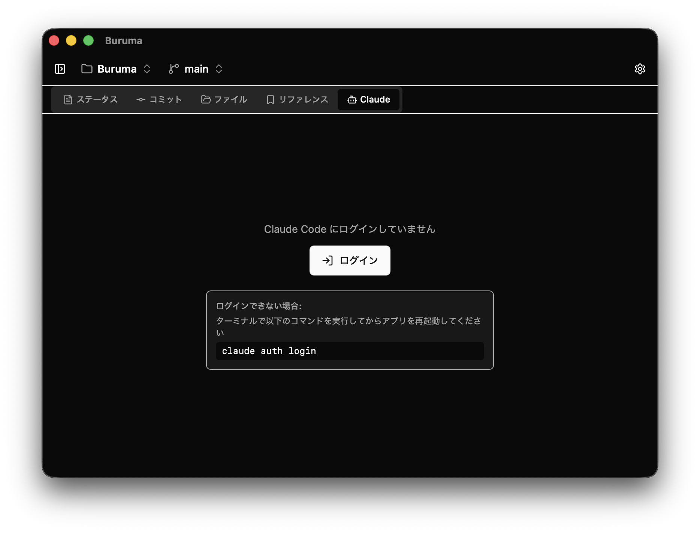
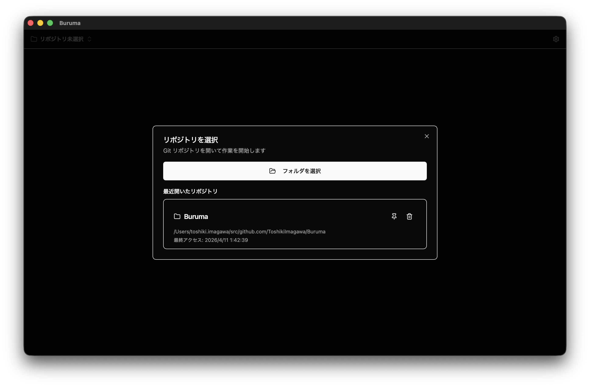
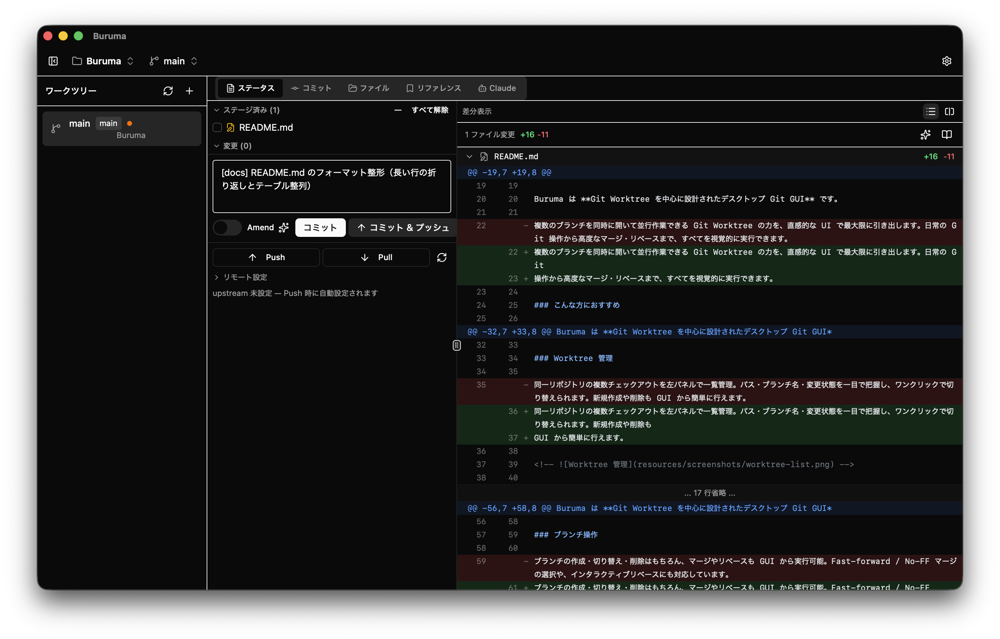

<div style="text-align: center;">
  
</div>

<div style="text-align: center;">
  <strong>Branch-United Real-time Understanding & Multi-worktree Analyzer</strong><br>
  Git Worktree に特化したデスクトップ Git クライアント
</div>

<div style="text-align: center;">
  
  
  
</div>

---

## Buruma とは

Buruma は **Git Worktree を中心に設計されたデスクトップ Git GUI** です。

複数のブランチを同時に開いて並行作業できる Git Worktree の力を、直感的な UI で最大限に引き出します。日常の Git
操作から高度なマージ・リベースまで、すべてを視覚的に実行できます。

### こんな方におすすめ

- 複数のブランチで同時に作業することが多い方
- Git コマンドを覚えなくても安全に Git 操作を行いたい方
- コンフリクト解決やリベースを視覚的に行いたい方
- AI（Claude）を活用してコードレビューや差分の解説を受けたい方

## 主な機能

### Worktree 管理

同一リポジトリの複数チェックアウトを左パネルで一覧管理。パス・ブランチ名・変更状態を一目で把握し、ワンクリックで切り替えられます。新規作成や削除も
GUI から簡単に行えます。



### ステータス & ステージング

変更ファイルをステージ済み・未ステージ・未追跡に分類して表示。ファイル単位またはハンク単位でステージング・アンステージングができ、意図した変更だけを正確にコミットできます。



### 差分ビュー

ファイルの変更内容をハンク表示またはサイドバイサイド表示で確認できます。

<!--  -->

### コミット履歴

コミット履歴を一覧表示し、各コミットの詳細や変更ファイルを確認できます。ブランチの分岐状況も視覚的に把握できます。



### ブランチ操作

ブランチの作成・切り替え・削除はもちろん、マージやリベースも GUI から実行可能。Fast-forward / No-FF
マージの選択や、インタラクティブリベースにも対応しています。

### コンフリクト解決

マージやリベースで発生したコンフリクトを 3 ウェイ表示で視覚的に解決できます。

### スタッシュ & タグ

変更の一時退避（スタッシュ）や、タグの作成・削除をリファレンスタブから管理できます。

### Claude Code 連携

ワークツリーごとに独立した Claude Code セッションを管理。現在の差分やコミット間の差分を Claude に送信し、コードレビューや差分の解説を受けられます。



## インストール

### 動作環境

- **macOS** (Apple Silicon)
- **Git** がインストールされていること

### ダウンロード

> 現在開発中のため、リリースビルドは準備中です。ソースからビルドしてお試しいただけます。

### ソースからビルド

#### 前提条件

- [Node.js](https://nodejs.org/) (v18 以上)
- [Rust](https://www.rust-lang.org/tools/install) (最新 stable)
- [Git](https://git-scm.com/)

#### 手順

```bash
# リポジトリをクローン
git clone https://github.com/ToshikiImagawa/Buruma.git
cd Buruma

# 依存パッケージをインストール
npm install

# 開発モードで起動
npm run tauri:dev

# リリースビルド（アプリバンドルを生成）
npm run tauri:build
```

リリースビルドの成果物は `src-tauri/target/release/bundle/` に出力されます。

## 使い方

### 1. リポジトリを開く

起動するとリポジトリ選択ダイアログが表示されます。「フォルダを選択」から Git リポジトリのあるディレクトリを選択してください。
一度開いたリポジトリは履歴に保存され、次回からすぐにアクセスできます。



### 2. Worktree を選択する

左パネルにワークツリーの一覧が表示されます。操作したいワークツリーをクリックすると、右側のメインパネルにその詳細が表示されます。「+」ボタンから新しいワークツリーを作成することもできます。

### 3. 変更を確認・コミットする

**ステータスタブ** で現在の変更を確認します。

1. 変更ファイルの一覧から、ステージしたいファイルを選択
2. 右側の差分ビューで変更内容を確認
3. ファイル単位またはハンク単位でステージング
4. コミットメッセージを入力してコミット
5. Push ボタンでリモートに反映

### 4. コミット履歴を閲覧する

**コミットタブ** でコミット履歴を確認できます。コミットを選択すると、詳細や変更ファイルが右パネルに表示されます。ここからチェリーピックやブランチの作成も行えます。

### 5. ブランチ操作を行う

コミットタブの左サイドバーから、以下の操作が行えます:

- **マージ**: 別ブランチの変更を統合
- **リベース**: コミット履歴を整理
- **新規ブランチ作成**: 現在のコミットから分岐

### 6. スタッシュ・タグを管理する

**リファレンスタブ** からスタッシュの保存・復元やタグの作成・削除が行えます。

### 7. Claude Code と連携する

**Claude タブ** で AI アシスタントと連携できます。
現在の差分を送信してレビューコメントや解説を受けたり、自然言語で Git 操作を指示したりできます。

## 設定

ヘッダーの歯車アイコンから設定ダイアログを開けます。

| 設定項目          | 説明                        |
|:--------------|:--------------------------|
| テーマ           | ライト / ダークモードの切り替え         |
| Git パス        | Git 実行ファイルのパスを指定（通常は自動検出） |
| デフォルト作業ディレクトリ | リポジトリ選択時の初期ディレクトリ         |
| コミットメッセージルール  | コミットメッセージのフォーマット設定        |

## 画面構成



## ライセンス

[MIT License](LICENSE)
